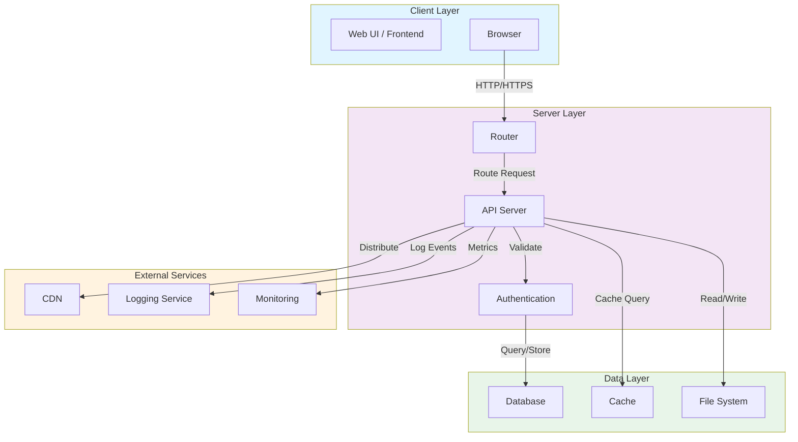

# Architecture Overview

## System Architecture Diagram

## Component Descriptions

### Client Layer
- **Web UI / Frontend**: The user-facing interface built with HTML, CSS, and JavaScript
- **Browser**: Client application executing the frontend code

### Server Layer
- **Router**: Handles incoming HTTP requests and routes them to appropriate handlers
- **API Server**: Core application logic and business logic processing
- **Authentication**: Manages user authentication and authorization

### Data Layer
- **Database**: Persistent data storage for application data
- **Cache**: In-memory cache for frequently accessed data
- **File System**: Storage for static assets and files

### External Services
- **CDN**: Content delivery network for distributing assets globally
- **Logging Service**: Centralized logging for debugging and monitoring
- **Monitoring**: Performance and health monitoring of the system

## Key Interactions
1. Client sends requests through the browser
2. Router directs requests to appropriate handlers
3. API server processes business logic with authentication validation
4. Data is retrieved from cache, database, or file system
5. Results are sent back to client, with assets distributed via CDN
6. All activity is logged and monitored
